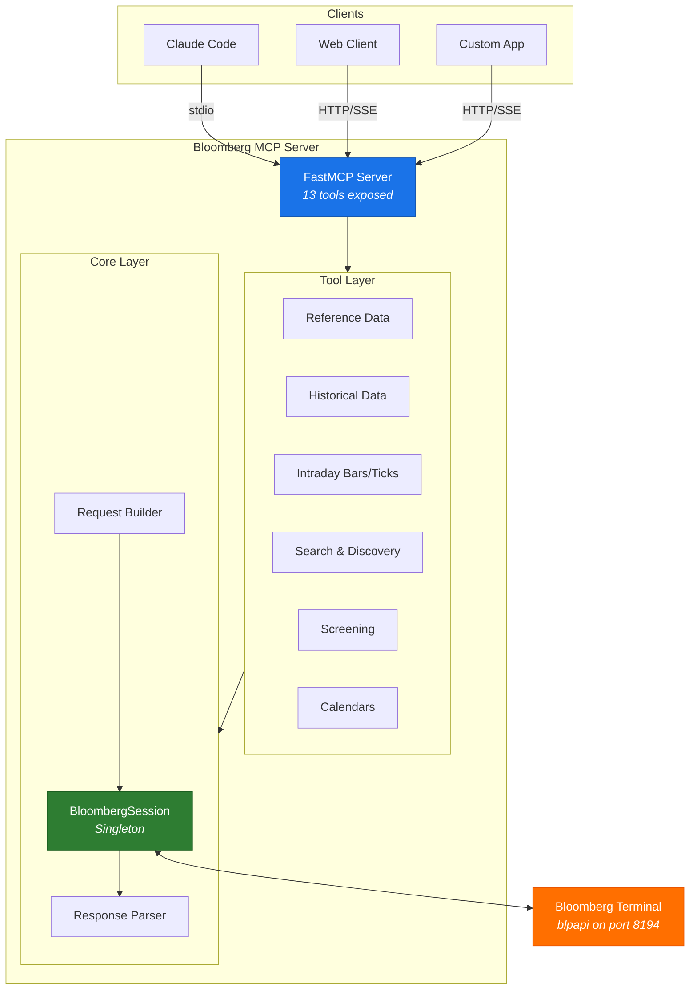
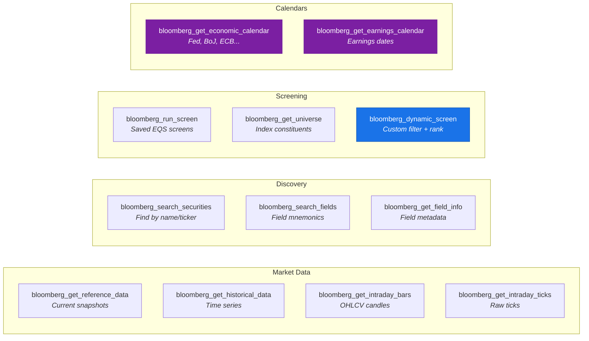
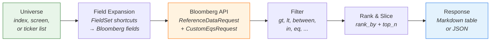
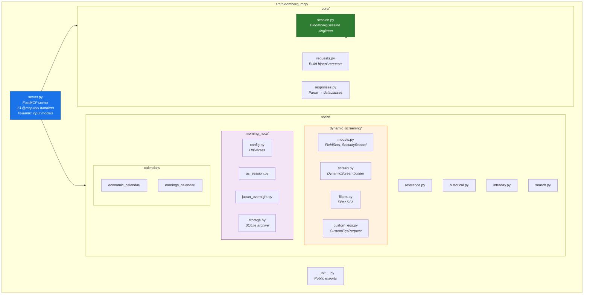
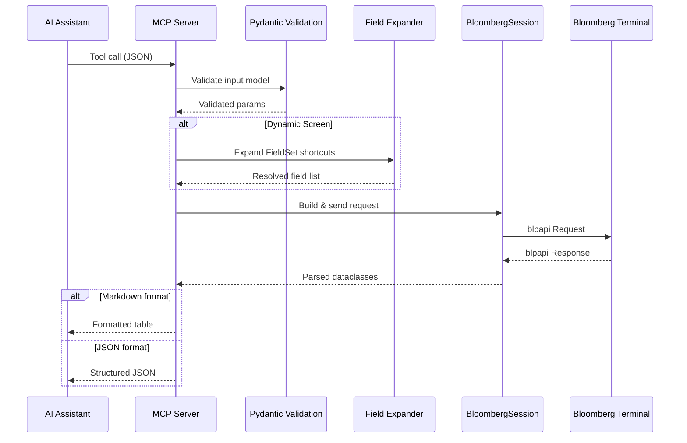
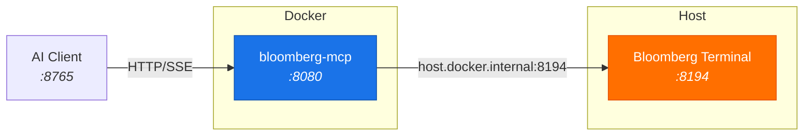

<p align="center">
  <h1 align="center">Bloomberg MCP</h1>
  <p align="center">
    A Model Context Protocol server that gives AI assistants direct access to Bloomberg Terminal data.
  </p>
  <p align="center">
    <a href="https://opensource.org/licenses/MIT"></a>
    <a href="https://www.python.org/downloads/"></a>
    <a href="https://modelcontextprotocol.io"></a>
  </p>
</p>

---

Bloomberg MCP bridges the Bloomberg Terminal with AI assistants via the [Model Context Protocol](https://modelcontextprotocol.io). It exposes 13 tools covering real-time data, historical analysis, screening, and calendars — all accessible through natural language.

```
You: "What are the top semiconductor stocks by relative volume today?"

Claude: runs bloomberg_dynamic_screen with SEMI_LEADERS universe, RVOL fields, ranked by rvol
        → Returns formatted table with NVDA, AMD, TSM... ranked by volume activity
```

## Architecture



## Tools Overview



### Tool Reference

| Tool | Description | Key Parameters |
|------|-------------|----------------|
| `bloomberg_get_reference_data` | Current field values for any security | `securities`, `fields`, `overrides` |
| `bloomberg_get_historical_data` | Time series with configurable periodicity | `securities`, `fields`, `start_date`, `end_date`, `periodicity` |
| `bloomberg_get_intraday_bars` | OHLCV candles (1/5/15/30/60 min) | `security`, `start_datetime`, `end_datetime`, `interval` |
| `bloomberg_get_intraday_ticks` | Raw tick-level trade/quote data | `security`, `start_datetime`, `end_datetime`, `event_types` |
| `bloomberg_search_securities` | Find securities by name or partial ticker | `query`, `yellow_key`, `max_results` |
| `bloomberg_search_fields` | Discover Bloomberg field mnemonics | `query`, `field_type` |
| `bloomberg_get_field_info` | Detailed field metadata and documentation | `field_ids` |
| `bloomberg_run_screen` | Execute saved Bloomberg EQS screens | `screen_name`, `screen_type` |
| `bloomberg_get_universe` | Index/screen constituents with optional fields | `source`, `include_fields` |
| `bloomberg_dynamic_screen` | Custom filtering, ranking, and field selection | `universe`, `fields`, `filters`, `rank_by`, `top_n` |
| `bloomberg_get_economic_calendar` | Upcoming macro releases by region/importance | `mode`, `regions`, `importance` |
| `bloomberg_get_earnings_calendar` | Earnings announcements by universe/timing | `mode`, `universe`, `days_ahead` |

All tools support `response_format`: `"markdown"` (default) or `"json"`.

## Installation

### Prerequisites

- Python 3.10+
- **Bloomberg Terminal running and logged in on the same machine** — the server connects to the Terminal's local API on `localhost:8194`. No separate API keys or tokens are needed; the Terminal session provides authentication.
- Bloomberg C++ SDK (`blpapi_cpp`)
- Bloomberg Python SDK (`blpapi`)

### Setup

```bash
# 1. Set Bloomberg C++ SDK path
export BLPAPI_ROOT=/path/to/blpapi_cpp_3.x.x.x

# 2. Install blpapi Python SDK
pip install blpapi

# 3. Install bloomberg-mcp
pip install -e .
```

### Configure Claude Code

Add to your Claude Code MCP settings (`.claude.json` or via Claude Code settings UI):

```json
{
  "mcpServers": {
    "bloomberg-mcp": {
      "command": "python",
      "args": ["-m", "bloomberg_mcp.server"],
      "cwd": "/path/to/bloomberg-mcp",
      "env": {
        "BLOOMBERG_HOST": "localhost",
        "BLOOMBERG_PORT": "8194"
      }
    }
  }
}
```

Restart Claude Code to load the server.

## Quick Start

### As a Python Library

```python
from bloomberg_mcp.tools import get_reference_data, get_historical_data

# Current prices and fundamentals
data = get_reference_data(
    securities=["AAPL US Equity", "MSFT US Equity"],
    fields=["PX_LAST", "PE_RATIO", "DIVIDEND_YIELD"]
)
for sec in data:
    print(f"{sec.security}: ${sec.fields.get('PX_LAST')}")

# Historical time series
hist = get_historical_data(
    securities=["SPY US Equity"],
    fields=["PX_LAST", "VOLUME"],
    start_date="20240101",
    end_date="20241231",
    periodicity="DAILY"
)
```

### As an MCP Server

```bash
# stdio (default — for Claude Code)
python -m bloomberg_mcp.server

# HTTP transport (for web clients)
python -m bloomberg_mcp.server --http --port=8080

# SSE transport (for streaming clients)
python -m bloomberg_mcp.server --sse --port=8080

# Windows convenience scripts
run_server.bat            # stdio
run_server.bat --http     # HTTP
```

## Dynamic Screening

The most powerful tool. Build custom screens with pre-validated field sets, filters, and ranking — no need to know Bloomberg field mnemonics.

### How It Works



### FieldSet Shortcuts

Instead of remembering Bloomberg field mnemonics, use shorthand names:

| FieldSet | Expands To | Fields |
|----------|-----------|--------|
| `PRICE` | `PX_LAST`, `PX_OPEN`, `PX_HIGH`, `PX_LOW`, `CHG_PCT_1D` | 5 |
| `MOMENTUM` | `CHG_PCT_1D`, `CHG_PCT_5D`, `CHG_PCT_1M`, `CHG_PCT_YTD` | 4 |
| `MOMENTUM_EXTENDED` | + `CHG_PCT_3M`, `CHG_PCT_6M`, `CHG_PCT_1YR` | 7 |
| `RVOL` | `VOLUME`, `VOLUME_AVG_20D`, `TURNOVER` + computed `rvol` | 3+1 |
| `TECHNICAL` | `RSI_14D`, `VOLATILITY_30D`, `VOLATILITY_90D`, `BETA_RAW_OVERRIDABLE` | 4 |
| `VOLATILITY` | `VOLATILITY_10D` through `VOLATILITY_260D` | 6 |
| `VALUATION` | `PE_RATIO`, `PX_TO_BOOK_RATIO`, `EV_TO_EBITDA`, `DIVIDEND_YIELD` | 5 |
| `ANALYST` | `EQY_REC_CONS`, `BEST_TARGET_PRICE`, `BEST_EPS` | 3 |
| `SECTOR` | `GICS_SECTOR_NAME`, `GICS_INDUSTRY_NAME` | 2 |
| `SENTIMENT` | `SHORT_INT_RATIO`, `PUT_CALL_OPEN_INTEREST_RATIO` | 2 |
| `SCREENING_FULL` | All of the above combined | 30+ |

### Filter Operators

| Operator | Description | Example |
|----------|-------------|---------|
| `gt` / `gte` | Greater than (or equal) | `{"field": "rvol", "op": "gt", "value": 1.5}` |
| `lt` / `lte` | Less than (or equal) | `{"field": "RSI_14D", "op": "lt", "value": 30}` |
| `eq` / `neq` | Equals / not equals | `{"field": "GICS_SECTOR_NAME", "op": "eq", "value": "Technology"}` |
| `between` | Range (inclusive) | `{"field": "PE_RATIO", "op": "between", "value": [10, 25]}` |
| `in` | Value in list | `{"field": "GICS_SECTOR_NAME", "op": "in", "value": ["Tech", "Health Care"]}` |

### Pre-Built Universes

| Universe | Description | Count |
|----------|-------------|-------|
| `MEGA_CAP_TECH` | AAPL, MSFT, GOOGL, AMZN, META, NVDA, TSLA | 7 |
| `SEMI_LEADERS` | NVDA, AMD, INTC, TSM, ASML, AVGO, QCOM... | 14 |
| `JAPAN_ADRS` | TM, HMC, SONY, MUFG, SMFG, NMR, NTDOY | 7 |
| `US_FINANCIALS` | JPM, BAC, GS, MS, C, WFC | 6 |
| `CONSUMER` | WMT, COST, TGT, HD, NKE, SBUX, MCD | 7 |
| `INDUSTRIALS` | CAT, DE, BA, FDX, UPS, GE, HON | 7 |
| `MORNING_NOTE` | Combined universe for daily analysis | 40+ |

You can also use Bloomberg index tickers (e.g., `index:SPX Index`) or saved EQS screen names (e.g., `screen:My_Custom_Screen`).

### Example: Find Oversold High-Volume Stocks

```json
{
  "universe": "index:SPX Index",
  "fields": ["PRICE", "RVOL", "TECHNICAL", "SECTOR"],
  "filters": [
    {"field": "RSI_14D", "op": "lt", "value": 30},
    {"field": "rvol", "op": "gt", "value": 2.0}
  ],
  "rank_by": "rvol",
  "rank_descending": true,
  "top_n": 20
}
```

## Project Structure



```
bloomberg-mcp/
├── src/bloomberg_mcp/
│   ├── __init__.py              # Public API exports
│   ├── server.py                # FastMCP server (13 tools)
│   ├── core/
│   │   ├── session.py           # BloombergSession singleton
│   │   ├── requests.py          # blpapi request builders
│   │   └── responses.py         # Response parsing → dataclasses
│   └── tools/
│       ├── reference.py         # get_reference_data()
│       ├── historical.py        # get_historical_data()
│       ├── intraday.py          # get_intraday_bars/ticks()
│       ├── search.py            # search_securities/fields()
│       ├── screening.py         # run_screen() (saved EQS)
│       ├── dynamic_screening/   # Custom screening DSL
│       ├── morning_note/        # Japan morning note toolkit
│       ├── earnings_calendar/   # Earnings announcements
│       └── economic_calendar/   # Macro event calendar
├── tests/
│   ├── test_session.py          # Unit tests (mocked blpapi)
│   ├── test_requests.py
│   ├── test_tools.py
│   └── integration/             # Requires live Bloomberg
├── examples/
│   ├── basic_usage.py           # Getting started
│   ├── explore_patterns.py      # Advanced screening patterns
│   └── verify_beqs_endpoint.py  # BEQS API verification
├── Dockerfile
├── docker-compose.yml
├── run_server.bat               # Windows launcher
├── run_server.ps1               # PowerShell launcher
└── pyproject.toml
```

## Data Flow



## Docker Deployment

For running the MCP server in a container (connects to Bloomberg Terminal on host):



```bash
# Build and start
docker-compose up -d

# View logs
docker-compose logs -f bloomberg-mcp

# Stop
docker-compose down
```

The container exposes port `8765` (mapped to internal `8080`) and connects to Bloomberg Terminal on the host via `host.docker.internal:8194`.

## Common Bloomberg Fields

<details>
<summary><b>Price & Volume</b></summary>

| Field | Description |
|-------|-------------|
| `PX_LAST` | Last price |
| `PX_BID` / `PX_ASK` | Bid / Ask |
| `PX_OPEN` / `PX_HIGH` / `PX_LOW` | OHLC |
| `VOLUME` | Trading volume |
| `CHG_PCT_1D` | 1-day change % |
| `CHG_PCT_YTD` | YTD change % |

</details>

<details>
<summary><b>Valuation</b></summary>

| Field | Description |
|-------|-------------|
| `PE_RATIO` | Price/Earnings (trailing) |
| `BEST_PE_RATIO` | Forward P/E (consensus) |
| `PX_TO_BOOK_RATIO` | Price/Book |
| `PX_TO_SALES_RATIO` | Price/Sales |
| `EV_TO_EBITDA` | EV/EBITDA |
| `DIVIDEND_YIELD` | Dividend yield % |
| `MARKET_CAP` | Market capitalization |

</details>

<details>
<summary><b>Technical & Risk</b></summary>

| Field | Description |
|-------|-------------|
| `RSI_14D` | 14-day RSI |
| `VOLATILITY_30D` / `VOLATILITY_90D` | Realized volatility % |
| `BETA_RAW_OVERRIDABLE` | Beta |
| `MOV_AVG_50D` / `MOV_AVG_200D` | Moving averages |

</details>

<details>
<summary><b>Profitability</b></summary>

| Field | Description |
|-------|-------------|
| `RETURN_ON_EQUITY` | ROE % |
| `RETURN_ON_ASSET` | ROA % |
| `RETURN_ON_INV_CAPITAL` | ROIC % |
| `GROSS_MARGIN` / `OPER_MARGIN` / `PROF_MARGIN` | Margin metrics |

</details>

<details>
<summary><b>Analyst</b></summary>

| Field | Description |
|-------|-------------|
| `EQY_REC_CONS` | Consensus rating (1=Strong Buy, 5=Sell) |
| `BEST_TARGET_PRICE` | Consensus target price |
| `BEST_EPS` | Consensus EPS estimate |

</details>

## Security Identifier Formats

```
AAPL US Equity       # US stock
VOD LN Equity        # UK stock (London)
7203 JP Equity       # Japan stock (numeric ticker)
SPX Index            # Index
EUR Curncy           # Currency
CL1 Comdty           # Commodity future
SPY US Equity        # ETF
```

## Environment Variables

| Variable | Default | Description |
|----------|---------|-------------|
| `BLOOMBERG_HOST` | `localhost` | Bloomberg API host |
| `BLOOMBERG_PORT` | `8194` | Bloomberg API port |
| `MCP_HOST` | `0.0.0.0` | Server bind address (HTTP/SSE only) |
| `MCP_PORT` | `8080` | Server port (HTTP/SSE only) |

## Contributing

Contributions are welcome! Please open an issue or submit a pull request.

```bash
# Install dev dependencies
pip install -e ".[dev]"

# Run tests (unit tests — no Bloomberg required)
pytest

# Run integration tests (requires Bloomberg Terminal)
pytest tests/integration/

# Format and lint
black src/ tests/
ruff check src/ tests/
mypy src/
```

## Requirements

- **Python 3.10+**
- **Bloomberg Terminal** or B-PIPE connection with API enabled
- **Bloomberg C++ SDK** (`blpapi_cpp`)
- **Bloomberg Python SDK** (`blpapi`)

## License

MIT - see [LICENSE](LICENSE) for details.
