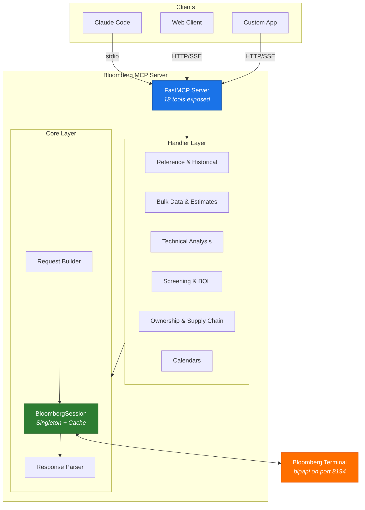
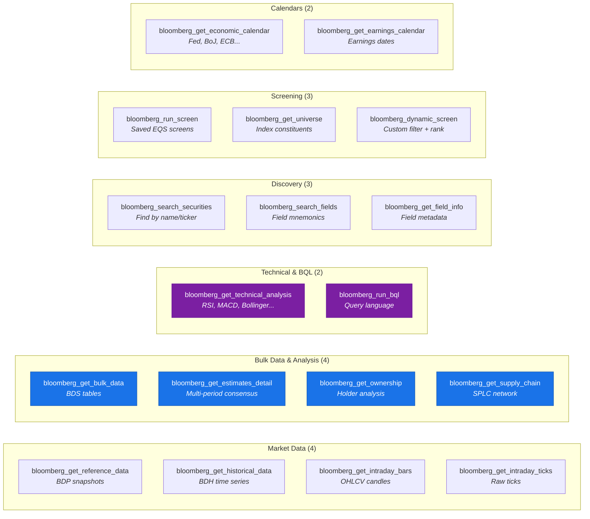
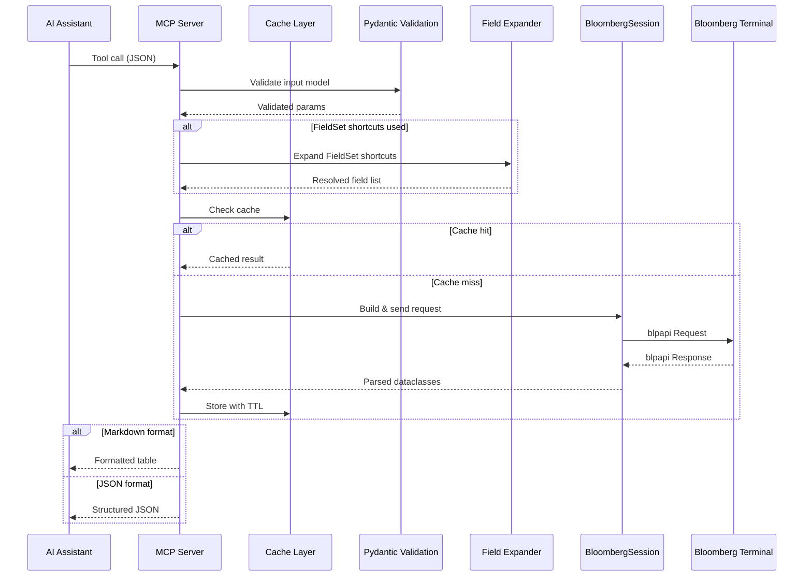
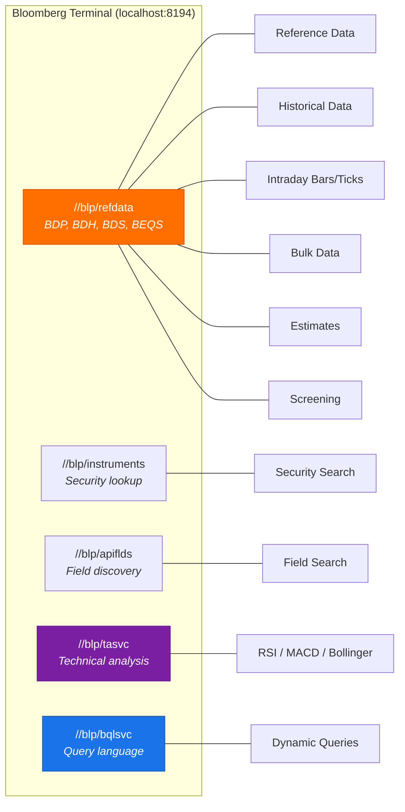
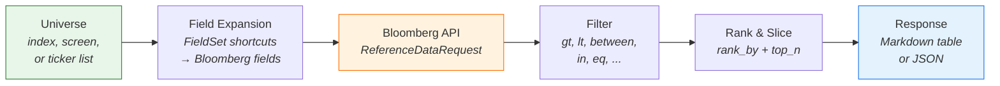
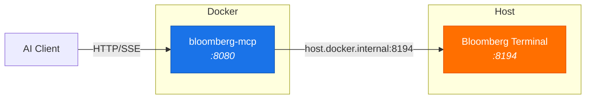

# Bloomberg MCP

A Model Context Protocol server that gives AI assistants direct access to Bloomberg Terminal data.

[](https://opensource.org/licenses/MIT)
[](https://www.python.org/downloads/)
[](https://modelcontextprotocol.io)

---

Bloomberg MCP bridges the Bloomberg Terminal with AI assistants via the [Model Context Protocol](https://modelcontextprotocol.io). It exposes **18 tools** covering reference data, bulk data, historical analysis, technical analysis, estimates, ownership, supply chain, screening, BQL queries, and calendars — all accessible through natural language.

> Enhanced fork of [tallinn102/bloomberg-mcp](https://github.com/tallinn102/bloomberg-mcp) — v1.1 adds 6 new tools, modular architecture, caching layer, and 10 analytical FieldSets.

```
You: "What are the top holders and supply chain for CEG US Equity?"

Claude: runs bloomberg_get_bulk_data with TOP_20_HOLDERS_PUBLIC_FILINGS
        runs bloomberg_get_supply_chain with suppliers + customers
        → Returns structured holder list + supplier/customer network
```

## Architecture



## Tools Overview (18 tools)



## What's New (vs upstream)

- **Modular architecture** — server.py refactored from 1,798 lines to ~89 lines. Handlers, models, formatters, and utils cleanly separated.
- **9 new tools** — BDS bulk data, multi-period estimates, technical analysis (//blp/tasvc), ownership analysis, supply chain (SPLC), BQL queries (//blp/bqlsvc), and more.
- **Cache layer** — TTL-based in-memory cache with data-type-aware expiration (30s for prices, 24h for static data).
- **10 new FieldSets** — Pre-defined field collections for estimates, profitability, cash flow, balance sheet, ownership, governance, risk, valuation, earnings surprise, and growth.
- **Full Bloomberg API surface** — Covers //blp/refdata, //blp/instruments, //blp/apiflds, //blp/tasvc, //blp/bqlsvc.

## Data Flow



## Bloomberg Services



## Tool Reference

### Market Data

| Tool | Description | Key Parameters |
|------|-------------|----------------|
| `bloomberg_get_reference_data` | Current field values (BDP) for any security | `securities`, `fields`, `overrides` |
| `bloomberg_get_historical_data` | Time series (BDH) with configurable periodicity | `securities`, `fields`, `start_date`, `end_date`, `periodicity` |
| `bloomberg_get_intraday_bars` | OHLCV candles (1/5/15/30/60 min) | `security`, `start_datetime`, `end_datetime`, `interval` |
| `bloomberg_get_intraday_ticks` | Raw tick-level trade/quote data | `security`, `start_datetime`, `end_datetime`, `event_types` |

### Bulk Data & Analysis — NEW

| Tool | Description | Key Parameters |
|------|-------------|----------------|
| `bloomberg_get_bulk_data` | Bulk reference data (BDS) — holders, dividends, supply chain, index members | `security`, `field`, `overrides`, `max_rows` |
| `bloomberg_get_estimates_detail` | Multi-period consensus estimates with revision momentum | `securities`, `periods`, `metrics` |
| `bloomberg_get_ownership` | Comprehensive ownership analysis (holders + insider + institutional) | `security`, `include_holders`, `include_changes` |
| `bloomberg_get_supply_chain` | Bloomberg SPLC supply chain data (suppliers, customers, competitors) | `security`, `include_suppliers`, `include_customers` |

### Technical Analysis & BQL — NEW

| Tool | Description | Key Parameters |
|------|-------------|----------------|
| `bloomberg_get_technical_analysis` | TA indicators via //blp/tasvc (RSI, MACD, Bollinger, SMA, EMA, DMI, Stochastic) | `security`, `indicators`, `start_date`, `end_date` |
| `bloomberg_run_bql` | Execute Bloomberg Query Language queries | `query` |

### Discovery

| Tool | Description | Key Parameters |
|------|-------------|----------------|
| `bloomberg_search_securities` | Find securities by name or partial ticker | `query`, `yellow_key`, `max_results` |
| `bloomberg_search_fields` | Discover Bloomberg field mnemonics | `query`, `field_type` |
| `bloomberg_get_field_info` | Detailed field metadata and documentation | `field_ids` |

### Screening

| Tool | Description | Key Parameters |
|------|-------------|----------------|
| `bloomberg_run_screen` | Execute saved Bloomberg EQS screens | `screen_name`, `screen_type` |
| `bloomberg_get_universe` | Index/screen constituents with optional fields | `source`, `include_fields` |
| `bloomberg_dynamic_screen` | Custom filtering, ranking, and field selection | `universe`, `fields`, `filters`, `rank_by`, `top_n` |

### Calendars

| Tool | Description | Key Parameters |
|------|-------------|----------------|
| `bloomberg_get_economic_calendar` | Upcoming macro releases by region/importance | `mode`, `regions`, `importance` |
| `bloomberg_get_earnings_calendar` | Earnings announcements by universe/timing | `mode`, `universe`, `days_ahead` |

All tools support `response_format`: `"markdown"` (default) or `"json"`.

## FieldSet Shortcuts

Instead of remembering Bloomberg field mnemonics, use shorthand names that expand to multiple fields.

### Core FieldSets

| FieldSet | Fields | Description |
|----------|--------|-------------|
| `PRICE` | 5 | PX_LAST, PX_OPEN, PX_HIGH, PX_LOW, CHG_PCT_1D |
| `MOMENTUM` | 4 | CHG_PCT_1D, CHG_PCT_5D, CHG_PCT_1M, CHG_PCT_YTD |
| `MOMENTUM_EXTENDED` | 7 | + CHG_PCT_3M, CHG_PCT_6M, CHG_PCT_1YR |
| `RVOL` | 3+1 | VOLUME, VOLUME_AVG_20D, TURNOVER + computed rvol |
| `TECHNICAL` | 4 | RSI_14D, VOLATILITY_30D, VOLATILITY_90D, BETA_RAW_OVERRIDABLE |
| `VALUATION` | 5 | PE_RATIO, PX_TO_BOOK_RATIO, EV_TO_EBITDA, DIVIDEND_YIELD, CUR_MKT_CAP |
| `ANALYST` | 3 | EQY_REC_CONS, BEST_TARGET_PRICE, BEST_EPS |
| `SECTOR` | 2 | GICS_SECTOR_NAME, GICS_INDUSTRY_NAME |
| `SCREENING_FULL` | 30+ | All of the above combined |

### Analytical FieldSets — NEW

| FieldSet | Fields | Key Bloomberg Mnemonics |
|----------|--------|------------------------|
| `ESTIMATES_CONSENSUS` | 10 | BEST_EPS, BEST_SALES, BEST_EPS_4WK_CHG, BEST_TARGET_PRICE |
| `PROFITABILITY` | 7 | GROSS_MARGIN, ROE, ROA, ROIC, OPER_MARGIN |
| `CASH_FLOW` | 6 | FCF_YIELD, CF_FROM_OPS, NET_INCOME, EBITDA |
| `BALANCE_SHEET` | 6 | D/E, INTEREST_COV, CUR_RATIO, NET_DEBT |
| `OWNERSHIP` | 5 | INSIDER%, INST%, SHORT_INT_RATIO |
| `GOVERNANCE` | 4 | ESG scores (overall, E, S, G) |
| `RISK` | 6 | BETA, VOL 10/30/90/260D, MKT_CAP |
| `VALUATION_EXTENDED` | 9 | PE, P/B, P/S, EV/EBITDA, P/FCF, DVD_YLD |
| `EARNINGS_SURPRISE` | 6 | EPS/sales actual vs estimate + surprise |
| `GROWTH` | 4 | Sales/EPS/EBITDA growth, LT growth est |

## Dynamic Screening

The most powerful tool. Build custom screens with pre-validated field sets, filters, and ranking — no need to know Bloomberg field mnemonics.



### Filter Operators

| Operator | Description | Example |
|----------|-------------|---------|
| `gt` / `gte` | Greater than (or equal) | `{"field": "rvol", "op": "gt", "value": 1.5}` |
| `lt` / `lte` | Less than (or equal) | `{"field": "RSI_14D", "op": "lt", "value": 30}` |
| `eq` / `neq` | Equals / not equals | `{"field": "GICS_SECTOR_NAME", "op": "eq", "value": "Technology"}` |
| `between` | Range (inclusive) | `{"field": "PE_RATIO", "op": "between", "value": [10, 25]}` |
| `in` | Value in list | `{"field": "GICS_SECTOR_NAME", "op": "in", "value": ["Tech", "Health Care"]}` |

### Example: Find Oversold High-Volume Stocks

```json
{
  "universe": "index:SPX Index",
  "fields": ["PRICE", "RVOL", "TECHNICAL", "SECTOR"],
  "filters": [
    {"field": "RSI_14D", "op": "lt", "value": 30},
    {"field": "rvol", "op": "gt", "value": 2.0}
  ],
  "rank_by": "rvol",
  "rank_descending": true,
  "top_n": 20
}
```

## Common BDS (Bulk Data) Fields

| Field | Returns |
|-------|---------|
| `TOP_20_HOLDERS_PUBLIC_FILINGS` | Top 20 shareholders with positions and dates |
| `DVD_HIST_ALL` | Complete dividend history |
| `SUPPLY_CHAIN_SUPPLIERS` | Supplier list with revenue exposure |
| `SUPPLY_CHAIN_CUSTOMERS` | Customer list with revenue exposure |
| `SUPPLY_CHAIN_COMPETITORS` | Competitor list |
| `INDX_MEMBERS` | Index constituents |
| `ANALYST_RECOMMENDATIONS` | Analyst ratings detail |
| `EARN_ANN_DT_TIME_HIST_WITH_EPS` | Historical earnings with actual EPS |
| `BOARD_OF_DIRECTORS` | Board members |

## Cache Layer

The built-in cache reduces Bloomberg API load with data-type-aware TTLs:

| Data Type | TTL | Rationale |
|-----------|-----|-----------|
| Static reference (name, sector) | 24 hours | Rarely changes |
| Financial statements | 7 days | Quarterly updates |
| Estimates / consensus | 4 hours | Updates throughout day |
| Price / volume | 30 seconds | Near real-time |
| Historical (EOD) | 12 hours | End-of-day data stable |
| Bulk data (holders, supply chain) | 24 hours | Daily updates |

## Project Structure

```mermaid
graph TB
    subgraph "src/bloomberg_mcp/"
        SERVER["server.py<br/><i>~89 lines, thin entry point</i>"]

        subgraph models["models/"]
            INPUTS["inputs.py<br/><i>22 Pydantic models</i>"]
            ENUMS["enums.py<br/><i>ResponseFormat, modes</i>"]
        end

        subgraph handlers["handlers/"]
            direction TB
            H_REF["reference.py"]
            H_HIST["historical.py"]
            H_INTRA["intraday.py"]
            H_SEARCH["search.py"]
            H_SCREEN["screening.py"]
            H_CAL["calendars.py"]
            H_BULK["bulk.py ★"]
            H_EST["estimates.py ★"]
            H_TECH["technical.py ★"]
            H_OWN["ownership.py ★"]
            H_SC["supply_chain.py ★"]
            H_BQL["bql.py ★"]
        end

        FMTR["formatters.py"]
        UTILS["utils.py"]

        subgraph core["core/"]
            SESSION["session.py<br/><i>Singleton</i>"]
            CACHE["cache.py ★<br/><i>TTL cache</i>"]
            REQ["requests.py"]
            RESP["responses.py"]
        end

        subgraph tools["tools/"]
            direction TB
            T_REF["reference.py"]
            T_HIST["historical.py"]
            T_SEARCH["search.py"]

            subgraph ds["dynamic_screening/"]
                MODELS_DS["models.py<br/><i>19+ FieldSets</i>"]
                SCREEN_DS["screen.py"]
                FILTERS["filters.py"]
            end

            subgraph mn["morning_note/"]
                MN_CFG["config.py"]
                MN_US["us_session.py"]
                MN_STORE["storage.py"]
            end
        end
    end

    SERVER --> handlers
    SERVER --> models
    handlers --> core
    handlers --> FMTR
    handlers --> UTILS

    style SERVER fill:#1a73e8,stroke:#1557b0,color:#fff
    style SESSION fill:#2e7d32,stroke:#1b5e20,color:#fff
    style CACHE fill:#2e7d32,stroke:#1b5e20,color:#fff
    style H_BULK fill:#e65100,stroke:#bf360c,color:#fff
    style H_EST fill:#e65100,stroke:#bf360c,color:#fff
    style H_TECH fill:#e65100,stroke:#bf360c,color:#fff
    style H_OWN fill:#e65100,stroke:#bf360c,color:#fff
    style H_SC fill:#e65100,stroke:#bf360c,color:#fff
    style H_BQL fill:#e65100,stroke:#bf360c,color:#fff
```



<small>★ = New in v1.1</small>

## Installation

### Prerequisites

- Python 3.10+
- **Bloomberg Terminal running and logged in** — connects via localhost:8194

### Setup

```bash
# 1. Install Bloomberg Python SDK
pip install blpapi

# 2. Install bloomberg-mcp
git clone https://github.com/QmQsun/Bloomberg-MCP.git
cd Bloomberg-MCP
pip install -e .
```

> **Note**: `blpapi` 3.19.0+ ships pre-built wheels — `pip install blpapi` works directly
> on Windows, macOS, and Linux without additional setup.
>
> If `pip install blpapi` fails (older platforms or Python versions), install via the C++ SDK:
> ```bash
> # Set Bloomberg C++ SDK path
> export BLPAPI_ROOT=/path/to/blpapi_cpp_3.x.x.x   # Linux/macOS
> set BLPAPI_ROOT=C:\blp\blpapi_cpp_3.x.x.x         # Windows
> pip install blpapi
> ```

### Configure Claude Code

Add to your Claude Code MCP settings:

```json
{
  "mcpServers": {
    "bloomberg-mcp": {
      "command": "python",
      "args": ["-m", "bloomberg_mcp.server"],
      "cwd": "/path/to/bloomberg-mcp",
      "env": {
        "BLOOMBERG_HOST": "localhost",
        "BLOOMBERG_PORT": "8194"
      }
    }
  }
}
```

## Quick Start

### As a Python Library

```python
from bloomberg_mcp.tools import get_reference_data, get_historical_data

# Current prices and fundamentals
data = get_reference_data(
    securities=["AAPL US Equity", "700 HK Equity", "2899 HK Equity"],
    fields=["PX_LAST", "PE_RATIO", "DIVIDEND_YIELD"]
)
for sec in data:
    print(f"{sec.security}: {sec.fields.get('PX_LAST')}")

# Multi-period estimates with overrides
data = get_reference_data(
    securities=["CEG US Equity"],
    fields=["BEST_EPS", "BEST_EPS_4WK_CHG", "BEST_TARGET_PRICE"],
    overrides={"BEST_FPERIOD_OVERRIDE": "1FY"}
)

# Historical time series
hist = get_historical_data(
    securities=["SPY US Equity"],
    fields=["PX_LAST", "VOLUME"],
    start_date="20240101",
    end_date="20241231",
    periodicity="DAILY"
)
```

### As an MCP Server

```bash
# stdio (default — for Claude Code)
python -m bloomberg_mcp.server

# HTTP transport (for web clients)
python -m bloomberg_mcp.server --http --port=8080

# SSE transport (for streaming clients)
python -m bloomberg_mcp.server --sse --port=8080
```

## Docker Deployment



```bash
docker-compose up -d
docker-compose logs -f bloomberg-mcp
```

## Security Identifier Formats

```
AAPL US Equity       # US stock
VOD LN Equity        # UK stock (London)
7203 JP Equity       # Japan stock (numeric)
700 HK Equity        # Hong Kong stock
1133 HK Equity       # Hong Kong stock (numeric)
601012 CH Equity     # A-share (Shanghai)
002594 CH Equity     # A-share (Shenzhen)
300750 CH Equity     # A-share (ChiNext)
SPX Index            # Index
HSI Index            # Hang Seng Index
VIX Index            # Volatility index
EUR Curncy           # Currency
CL1 Comdty           # Commodity future
SPY US Equity        # ETF
```

## Contributing

Contributions welcome! Please open an issue or submit a pull request.

```bash
pip install -e ".[dev]"
pytest                    # Unit tests (no Bloomberg needed)
pytest tests/integration/ # Integration tests (needs Terminal)
black src/ tests/
ruff check src/ tests/
```

## Contributors

| | Contributor | Role |
|---|---|---|
| 1 | [QmQsun](https://github.com/QmQsun) | Architecture refactor, 6 new tools, caching layer, FieldSets, code review |
| 2 | Claude (Anthropic) | Implementation assistance, code generation, QA |
| 3 | [tallinn102](https://github.com/tallinn102/bloomberg-mcp) | Original project foundation |

## License

MIT — see [LICENSE](LICENSE) for details.
